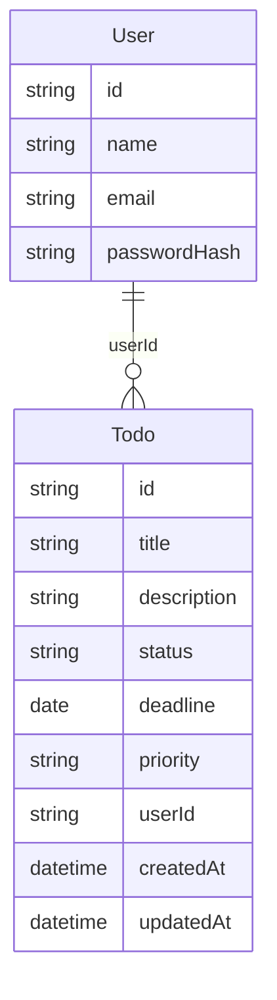

ER 図

```mermaid
erDiagram

    %% =========================
    %% Entities
    %% =========================

    Todo {
        string id
        string title
        string description
        string status
        date   deadline
        string priority
        string userId
        datetime createdAt
        datetime updatedAt
    }

    User {
        string id
        string name
        string email
        string passwordHash
    }

    %% =========================
    %% Relationships
    %% =========================

    %% Todo は User に属する（Aggregate 外部参照）
    User ||--o{ Todo : userId
```
